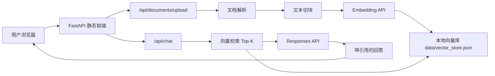

# Simple RAG ChatGPT

一个适合 NLP / LLM 方向展示的简易 ChatGPT 项目：支持上传知识库文档、生成向量索引、检索相关片段，再通过 OpenAI API 生成带引用的回答。

## 功能

- 聊天界面：类 ChatGPT 的单页对话体验
- RAG：上传 `.txt`、`.md`、`.pdf`、`.docx` 后自动切块、Embedding、检索
- 来源引用：回答返回命中的知识库片段和相似度
- 本地向量库：用 JSON 保存文档、chunk 和向量，方便学习与演示
- 后端 API：FastAPI 提供文档管理、检索、聊天接口
- 可扩展：本地 JSON 向量库可以替换为 pgvector、Qdrant、Milvus、Chroma

## 技术栈

- Backend：Python、FastAPI、OpenAI Python SDK
- LLM：OpenAI Responses API
- Embedding：`text-embedding-3-small`
- Frontend：原生 HTML / CSS / JavaScript
- Storage：本地 JSON vector store

OpenAI 当前文档建议新项目使用 Responses API；模型选择可以按成本与延迟使用 `gpt-5.4-mini`，也可以在 `.env` 中切换到你账号可用的模型。参考：

- [OpenAI Responses API](https://platform.openai.com/docs/api-reference/responses)
- [OpenAI Models](https://developers.openai.com/api/docs/models)
- [text-embedding-3-small](https://developers.openai.com/api/docs/models/text-embedding-3-small)

## 架构



## 快速运行

```powershell
cd C:\Users\LI JIASEN\Desktop\实习\simple-rag-chatgpt
.\run.ps1
```

首次运行会自动创建 `.venv` 并复制 `.env.example` 为 `.env`。打开 `.env`，填入：

```env
OPENAI_API_KEY=你的 API Key
OPENAI_CHAT_MODEL=gpt-5.4-mini
OPENAI_EMBEDDING_MODEL=text-embedding-3-small
```

启动后访问：

```text
http://127.0.0.1:8000
```

如果没有配置 API Key，页面仍可打开，但上传、检索和聊天会提示配置缺失。

## 使用流程

1. 启动服务并打开浏览器。
2. 在左侧上传知识库文档，可以先用 `data/samples/company_knowledge.md`。
3. 等待索引完成。
4. 在右侧提问，例如：“项目支持哪些文件格式？”、“请总结知识库里的产品能力”。
5. 查看回答下方的来源片段。

## API

| Method | Path | 说明 |
| --- | --- | --- |
| `GET` | `/api/health` | 服务状态、模型、索引统计 |
| `GET` | `/api/documents` | 文档列表 |
| `POST` | `/api/documents/upload` | 上传并索引文档 |
| `DELETE` | `/api/documents/{id}` | 删除文档及其向量 |
| `POST` | `/api/search` | 只做向量检索 |
| `POST` | `/api/chat` | RAG 聊天 |

## 测试

```powershell
.\.venv\Scripts\python.exe -m pytest
```

测试覆盖文本切块、余弦相似度、本地向量库增删查；不需要真实 API Key。

## 项目亮点

- 前端不会接触 API Key，所有模型调用都在后端完成。
- RAG prompt 会要求模型优先依据资料回答，资料不足时说明限制。
- 索引记录了原始文档名、chunk 编号、相似度，便于展示可解释性。
- 代码没有强绑定 LangChain，核心流程清晰，适合作为学习项目继续扩展。

## 可继续扩展

- 增加流式输出 SSE
- 接入 pgvector / Qdrant / Milvus
- 增加用户登录和多知识库隔离
- 加入 reranker 提升召回质量
- 支持网页爬取和定时知识库更新

